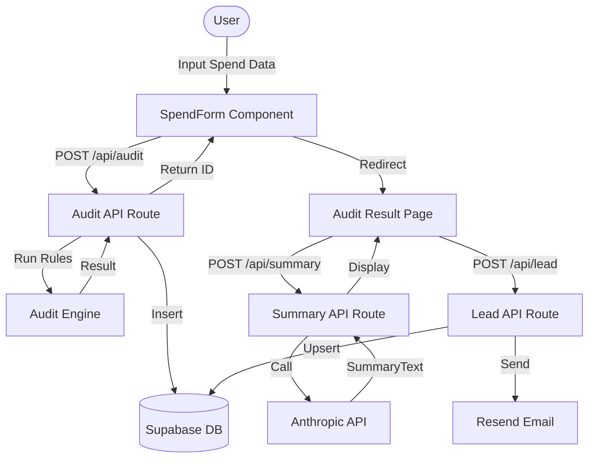

# System Architecture

## Data Flow Diagram

## Stack Justification

- **Next.js:** Essential for SSR to enable dynamic Open Graph tags for shareable audit URLs.
- **Supabase:** Provides a robust, managed backend with RLS, perfect for rapid deployment and lead storage.
- **Vercel:** Optimized for Next.js, providing edge functions for rate limiting and global delivery.
- **Anthropic Haiku:** Cost-effective model for generating concise, high-quality audit summaries.

## Scaling Plan (10k audits/day)

- **Edge Caching:** Cache audit results at the edge using Vercel's ISR or Cache-Control headers.
- **Connection Pooling:** Utilize Supabase's built-in connection pooling for high-concurrency DB access.
- **Rate Limiting:** Transition from in-memory Map to Redis (Upstash) for distributed rate limiting.
- **Background Jobs:** Move email sending to a background worker if Resend latency becomes a bottleneck.
